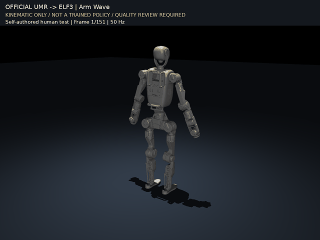
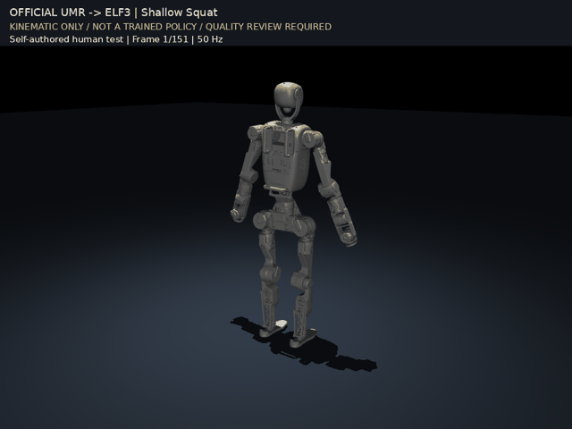

# Official UMR → ELF3

[](https://github.com/ChRis98Wang/umr_elf3-/actions/workflows/ci.yml)
[](LICENSE)

将人体动作重定向到 **ELF3 31 自由度机器人**。新接入流程使用作者的
[官方 UMR](https://github.com/hanyang9/UMR)，固定版本 `e24fc070`；保留原始
URDF 关节轴、限位和质量，提供完整动作处理、质量检查、GIF / MP4 与来源校验。

Official UMR integration for ELF3, with full-clip retargeting and auditable
kinematic demos. **Not a trained control policy or a completed ScaleBFM reproduction.**

[官方安装与运行](docs/OFFICIAL_UMR.md) · [实跑结果](docs/OFFICIAL_VALIDATION_20260917.md) ·
[历史数据状态](docs/STATUS.md) · [数据授权边界](docs/DATASET.md)

## 实际运行示例

以下为本仓库实际运行的 **官方 UMR 输出**，不是直接编写 ELF3 关节动画。
输入为本仓库自建的人体参数动作，**不使用 AMASS 动捕片段**；每段完整 151 帧、50 Hz。
GIF 可直接观看，点击图片或 MP4 链接查看原始录像。

| 双臂抬起 | 单臂摆动 | 浅蹲与起身 |
|---|---|---|
| [](docs/media/official_arm_raise.mp4) | [](docs/media/official_arm_wave.mp4) | [](docs/media/official_shallow_squat.mp4) |
| [MP4 原文件](docs/media/official_arm_raise.mp4) | [MP4 原文件](docs/media/official_arm_wave.mp4) | [MP4 原文件](docs/media/official_shallow_squat.mp4) |

**这些是 MuJoCo 运动学回放，不是策略推理、物理控制或实机演示。**
官方默认 LQR 平滑保留，没有叠加旧版轨迹优化器。三个示例的关节角度/速度超限均为 0；
脚部最低高度约为地面以上 15.4 mm，尚不能证明真实足底接触或平衡。
它们展示流程可运行，不代表动作库整体质量达标。
[录像来源与校验值](docs/media/manifest.json) · [示例说明](docs/DEMO_VIDEOS.md)

## 做到哪一步

| 工作项 | 当前状态 |
|---|---|
| ELF3 31 关节接入 | URDF/MJCF 轴、限位、质量及随机姿态 FK 校验通过 |
| 官方 UMR 对应学习 → 重定向 → 导出 | 1 条完整 AMASS 样本 + 3 条自建示例跑通，共 644 帧 |
| 实际 GIF / MP4 示例 | 上述 3 段，包含来源、结果哈希和质量标注 |
| 原有非官方批处理结果 | 487 条原始结果 / 465 条优化候选；保留作对照，未转为官方数据 |
| 全库迁移与质量验收 | **未完成**；9,483 条计划未重新批量执行 |
| ELF3 策略训练、物理跟踪、搬箱与实机 | **未完成**；没有训练批准数据或已训练 ELF3 策略 |

官方实跑用独立 Python 3.12 环境，不修改旧 UMR 或 IsaacLab 环境。
本地测试：**201 项，174 通过、27 明确跳过**。CPU 测试通过不等于动作质量验收。

## 开始使用

```bash
git clone --recurse-submodules https://github.com/ChRis98Wang/umr_elf3-.git
cd umr_elf3-
```

按[官方接入指南](docs/OFFICIAL_UMR.md)下载固定版本的官方 UMR 及必需的 LFS
分区文件，建立独立环境，指定自己合法持有的 ELF3 资产和 SMPL-X 模型。

```bash
# prepare 只准备完整源动作及 ELF3 配置；run 才执行学习和重定向。
local/venv_umr_official/bin/python scripts/run_official_elf3.py prepare --help
local/venv_umr_official/bin/python scripts/run_official_elf3.py run --help

# 对已经完成的官方结果导出录像。
MUJOCO_GL=egl local/venv_umr_official/bin/python scripts/preview_official_elf3.py \
  --run local/official_trial --output local/official_preview
```

历史非官方后端仍位于 `external/umr_trial_20260908`，仅供复现和比较；
旧入口 `launch_elf3_library.py` **仍运行旧后端**，不会自动切换成官方。
见[旧环境安装](docs/SETUP.md)、[技术路线](docs/TECHNICAL_ROUTE.md)与[工具说明](docs/TOOLS.md)。

## 数据与许可证

适配代码 MIT **不覆盖**第三方 UMR、ELF3 资产、人体模型或动作数据。
官方代码保留在本地独立 checkout，没有作为本仓库 MIT 代码重新分发。
仓库中的示例录像仅展示机器人渲染，不包含人体模型或机器人网格。

AMASS 派生数据包（487 条原始结果 + 465 条优化候选，约 94.17 MiB）仍仅在本地，
公开下载等待再分发许可确认。原全库队列保持停止。
详见 [NOTICE](NOTICE.md)、[数据卡](docs/DATASET.md)与[贡献规则](CONTRIBUTING.md)。
